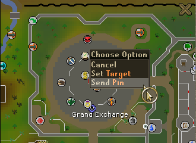
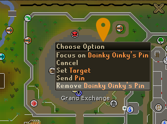

# Party World Map Pin
This plugin allows you to drop and send pins on the World Map for all your party members with the plugin to see. This will allow you to direct your friends to a specific part of the map for easier understanding.

## Settings
Customize the color of your pin. This custom color will also be seen by your party members.

## How To Add A Pin
Just open up the World Map and right click anywhere on the map. You will now see a new option "Send Pin". Once you click this a new pin will be placed on the map on both yours and all party members map. 

## How To Remove A Pin 
Whenever you wish to remove a pin you or a party member placed on the map, just right-click the pin and press the "Remove" menu option. This will only remove the pin for you so no need to worry about removing it for other party members!

